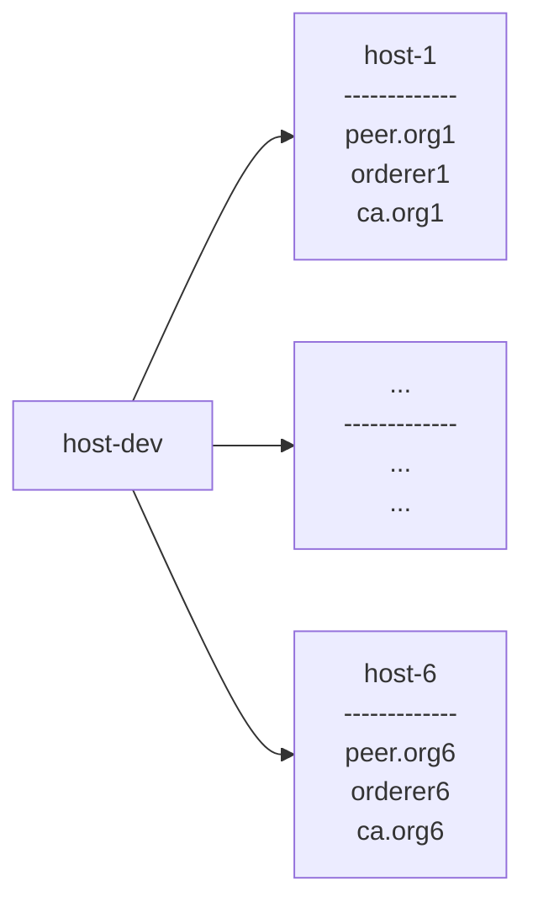

# README

**本项目为了管理复杂的Hyperledger Fabric 实验网络，弥补shell scripts在各方面的不足而写。**

目前架构为一个`host-dev`主机和6个`host`节点。
主机上生成配置并向六个节点同步配置、发送指令

## 网络架构

```mermaid
graph LR;

HD-->H1;
HD-->HM;
HD-->H6;

HD[host-dev  ]
H1[host-1
-------------
peer.org1
orderer1
ca.org1 ]


HM[...
-------------
...
... ]


H6[host-6
-------------
peer.org6
orderer6
ca.org6 ]
```